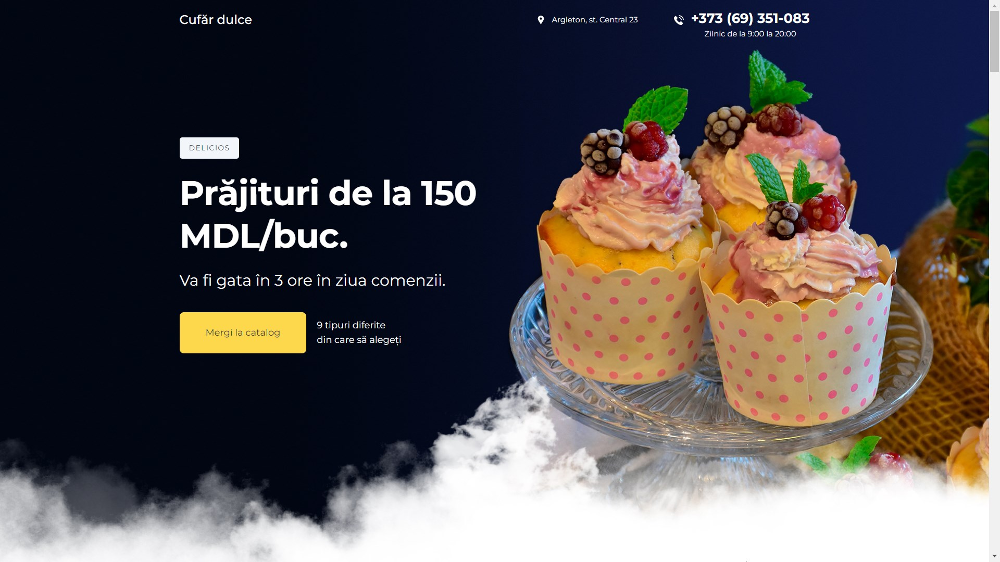
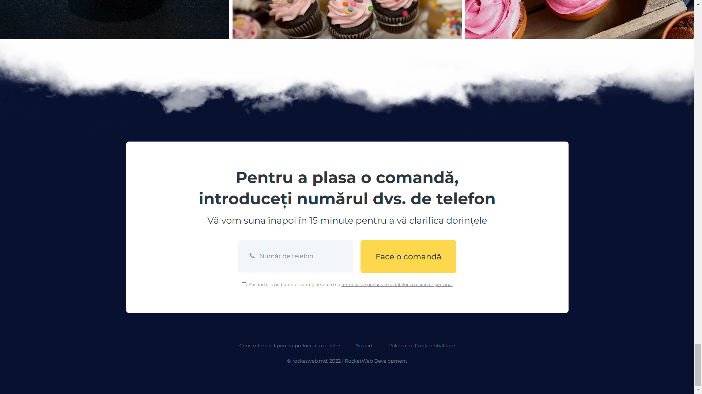

# TastyChest Project


[](https://head0223.github.io/tastyChest/)

This project represents a website for a cupcake business, showcasing a variety of cupcakes. The website is designed with HTML, CSS, and utilizes the Slick Carousel library for image sliders. Used SCSS with @mixin

## Table of Contents

-  [Folder Structure](#folder-structure)
-  [Usage](#usage)
-  [Media](#media)
-  [Contributing](#contributing)
-  [Dependencies](#dependencies)

## Folder Structure

-  **css:** Contains the styles for the website.
-  **img:** Holds all the images used in the project.
-  **js:** Includes the JavaScript file for additional functionality.

## Usage

1. Clone the repository:

```bash
git clone https://github.com/HEAD0223/tastyChest.git
cd tastyChest
```

2. Open the index.html file in a web browser to view the website.

## Media






## Contributing

If you would like to contribute to this project, please follow these steps:

1. Fork the repository.
2. Create a new branch for your feature: `git checkout -b feature-name`
3. Commit your changes: `git commit -m 'Add some feature'`
4. Push to the branch: `git push origin feature-name`
5. Submit a pull request.

## Dependencies

-  **jQuery:** JavaScript library.
-  **Slick Carousel:** Responsive carousel jQuery plugin.

Make sure to include these dependencies in your project.
